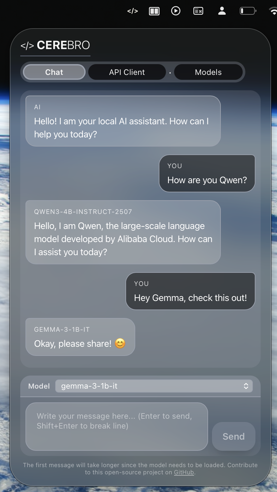

# Cerebro Client

<!--  -->

Local-first desktop app built with **Tauri + React** that lets you:

- Chat with **local** Hugging Face models (downloaded to your machine)
- Download/manage models from a curated list
- Use a lightweight **API Client** to send HTTP requests to your own backends

---

## English

### Why this project exists

Cerebro Client is a desktop UI to run and experiment with local LLMs.

The main goals are:

- **Local-first**: models run on your machine
- **Simple UX**: chat, model management, and a small API client in one app
- **Practical**: quick iteration for local AI workflows and testing

### How it works (high level)

The app has three main parts:

1. **React UI** (Vite)
	- Chat interface
	- Models screen (download + installed list)
	- API Client screen (HTTP requests)

2. **Tauri backend (Rust)**
	- Exposes commands to the UI via `invoke(...)`
	- Emits events back to the UI (token streaming, download progress, errors)

3. **Python runner** (sidecar)
	- Downloads models from Hugging Face and reports byte progress
	- Loads local models via `transformers` and generates text
	- Streams generated text chunks back to the Tauri layer

### Features

- **Chat** with local models
  - Token-by-token streaming to the UI
  - Cancel generation (stopping criteria)

- **Model downloads**
  - Download from Hugging Face repos
  - Progress reporting
  - Optional Hugging Face token support (for gated models / rate limits)

- **API Client**
  - Send requests (method, URL, headers, JSON body)
  - Stores history locally

### Project structure

- `src/` — React UI (Chat, Models, API Client)
- `src-tauri/` — Tauri Rust backend
- `src-tauri/py/` — Python runner sidecar

### Requirements

- **Bun** (required by Tauri build hooks in `src-tauri/tauri.conf.json`)
- Node.js (optional if you use Bun end-to-end)
- Rust toolchain for Tauri
- Python for the runner (plus the required packages)

### Install & Run (development)

1. Install JS deps

	- `bun install`
	- or `npm install` (deps only; you still need Bun installed)

2. Start the desktop app

	- `bun run tauri dev`
	- or `npm run tauri dev` (Bun still required by Tauri hooks)

### Python dependencies

The Python sidecar requires packages such as:

- `transformers`
- `torch`
- `huggingface_hub`
- `requests`

Install them in the same Python environment that runs the sidecar.

## Português

### Por que esse projeto existe

O Cerebro Client é uma aplicação desktop para executar e testar LLMs localmente.

Os principais objetivos são:

- **Local-first**: os modelos rodam na sua máquina
- **UX simples**: chat, gerenciamento de modelos e um API client em um único app
- **Prático**: facilitar o fluxo de trabalho com IA local e testes rápidos

### Como funciona (visão geral)

O app tem três partes principais:

1. **UI em React** (Vite)
	- Tela de Chat
	- Tela de Models (download e lista de instalados)
	- Tela de API Client (requisições HTTP)

2. **Backend Tauri (Rust)**
	- Expõe comandos para a UI via `invoke(...)`
	- Emite eventos para a UI (stream de tokens, progresso de download, erros)

3. **Runner em Python** (sidecar)
	- Baixa modelos do Hugging Face e reporta progresso em bytes
	- Carrega modelos locais via `transformers` e gera texto
	- Faz streaming do texto gerado de volta para a camada do Tauri

### Funcionalidades

- **Chat** com modelos locais
  - Streaming de tokens para a UI
  - Cancelamento de geração (stopping criteria)

- **Download de modelos**
  - Download de repositórios do Hugging Face
  - Progresso de download
  - Suporte a token do Hugging Face (para modelos restritos / rate limit)

- **API Client**
  - Envia requisições (método, URL, headers, JSON body)
  - Salva histórico localmente

### Estrutura do projeto

- `src/` — UI em React (Chat, Models, API Client)
- `src-tauri/` — Backend em Rust (Tauri)
- `src-tauri/py/` — Runner em Python (sidecar)

### Requisitos

- **Bun** (obrigatório por causa dos hooks de build em `src-tauri/tauri.conf.json`)
- Node.js (opcional se você usar Bun para tudo)
- Toolchain Rust para o Tauri
- Python para o runner (com os pacotes necessários)

### Instalar & Rodar (desenvolvimento)

1. Instale as dependências JS

	- `bun install`
	- ou `npm install` (apenas deps; o Bun continua sendo necessário)

2. Rode o app desktop

	- `bun run tauri dev`
	- ou `npm run tauri dev` (o Bun continua sendo necessário)

### Dependências Python

O sidecar Python precisa de pacotes como:

- `transformers`
- `torch`
- `huggingface_hub`
- `requests`

Instale no mesmo ambiente Python que executa o sidecar.

